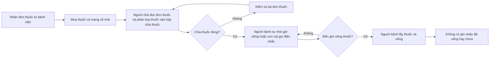
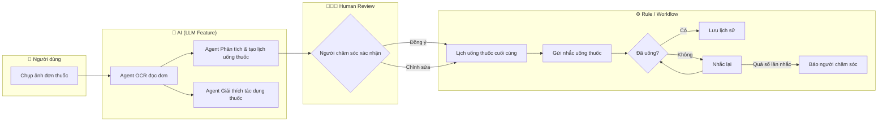

# Group Report — Day 02

## Thành viên nhóm

| STT | Họ và tên | Mã học viên | Vai trò trong nhóm |
|-----|-----------|-------------|--------------------|
| 1   |  Hà Anh Tuấn         |     2A202601582         |   Work flow/slide                 |
| 2   |  Dương Đức Minh         | 2A202601306            |  Nhóm trưởng / Tech Lead                  |
| 3   |   Phạm Tấn Gia Quốc        |  2A202601606           |      Thành viên              |
| 4   |  Nguyễn Thanh Tùng         |  2A202601140           |   Workflow/ Success Metrics                 |
| 5   |  Nguyễn Minh Đạt         |   2A202601142          |   Research                 |

---

## Phase 3 — Group Convergence (Hội tụ nhóm)

Nhóm đã tổng hợp và thảo luận từ các candidate problems cá nhân để chọn ra bài toán sâu sắc nhất.

### 1. Gom trùng / phân cụm (Clustering)

| Cluster | Candidates included | Pattern chung | Ghi chú |
|---|---|---|---|
| **Cụm A: Giáo dục** | Soạn đề cương kiểm tra; Tự ôn tập bài tập khó; Nhận xét bài tự luận tiếng Anh. | Giáo viên chuẩn bị tài liệu/chấm điểm và học sinh tự học ngoài giờ. | Dễ làm, workflow tuyến tính rõ ràng. |
| **Cụm B: Y tế** | Giải thích đơn thuốc & nhắc uống thuốc cho người già; Lưu trữ/tóm tắt lịch sử khám bệnh. | Hỗ trợ người bệnh đọc hiểu thông tin y khoa và quản lý lịch trình điều trị tại nhà. | Pain point cực kỳ cao. |
| **Cụm C: Bất động sản** | Tự động viết và đăng tin đa kênh; So sánh định giá và lọc tin đăng thật/ảo. | Môi giới tối ưu tin đăng, khách hàng tìm kiếm thông tin thật. | Quy trình phụ thuộc bên thứ ba. |

### 2. Shortlist & Scoring

Nhóm lọc ra 3 ứng viên sáng giá nhất để chấm điểm đồng thuận (thang điểm 1-5):

| Candidate | Actor rõ | Workflow rõ | Pain có evidence | Impact đo được | Làm trong lab | So sánh R/W/A được | Nhóm hiểu domain | Tổng |
|---|---:|---:|---:|---:|---:|---:|---:|---:|
| **Soạn đề ôn tập (GD)** | 5 | 5 | 4 | 4 | 5 | 4 | 4 | **31** |
| **Đăng tin BĐS đa kênh (BĐS)** | 4 | 4 | 4 | 4 | 4 | 4 | 3 | **27** |
| **Nhắc thuốc & giải thích đơn thuốc (YT)** | 5 | 5 | 5 | 5 | 4 | 5 | 4 | **33** |

* **Quyết định chọn của nhóm:** Nhóm thống nhất chọn bài toán **"Giải thích đơn thuốc y khoa và nhắc lịch uống thuốc cho người già"**.
* **Vì sao chọn:**
  * **Tính cấp thiết cao:** Người già có bệnh nền mãn tính (huyết áp, tiểu đường) bắt buộc uống nhiều loại thuốc đúng giờ. Việc nhầm lẫn hay quên thuốc ảnh hưởng trực tiếp tới tính mạng và sức khỏe.
  * **Giải pháp hiện tại chưa tốt:** Các ứng dụng nhắc nhở hiện tại (MyTherapy, Medisafe) quá phức tạp cho người lớn tuổi vì yêu cầu nhập liệu thủ công bằng tiếng Anh/chữ nhỏ, giao diện khó dùng.
  * **Vai trò AI rõ ràng:** AI giúp giải quyết khâu OCR đọc chữ viết tay bác sĩ, dịch thuật ngữ y học phức tạp thành ngôn ngữ bình dân (sáng/trưa/chiều uống viên nào, công dụng thuốc là gì) và tạo lịch nhắc tự động bằng giọng nói (Voice AI).
* **Vì sao không chọn các bài khác:**
  * *Soạn đề ôn tập:* Mặc dù quy trình rất rõ nhưng impact về mặt xã hội không mạnh mẽ và nhức nhối bằng y tế.
  * *Đăng tin BĐS:* Scope phụ thuộc nhiều vào API đăng bài của các bên thứ ba (Facebook, Zalo) vốn liên tục thay đổi và dễ bị quét spam, khó xây dựng demo an toàn trong khuôn khổ lớp học.

---

## Phase 4 — Quick Validation + Research giải pháp

### 1. Quick Validation (Kiểm chứng nhanh)

Nhóm đã thực hiện khảo sát nhanh qua phỏng vấn 3 người thuộc nhóm đối tượng đích và khảo sát Discord Poll:

* **Kết quả phỏng vấn:**
  * **Bác X** (người thân bạn T, Bệnh nhân cao huyết áp & tiểu đường): *"Mỗi ngày tôi uống 6 loại thuốc. Có loại uống trước ăn, có loại sau ăn, thuốc viên tròn màu vàng, viên nhộng xanh. Nhiều hôm mệt tôi không nhớ đã uống thuốc huyết áp chưa, đành uống đại hoặc bỏ luôn vì sợ uống quá liều."*
  * **Chị Y** (con dâu bác X): *"Mình đi làm xa cả ngày, lo nhất là mẹ quên uống thuốc tiểu đường. Cài app nhắc thuốc trên máy mẹ nhưng giao diện toàn chữ nhỏ, mẹ không biết bấm. Giá có cái gì tự động gọi điện hoặc phát loa nhắc tiếng Việt thì tốt."*

### 2. Research giải pháp đã có trên thị trường

Nhóm đã tìm kiếm các giải pháp hiện tại để tránh thiết kế lại bánh xe:

| Nguồn / tool / case | Link | Họ giải quyết phần nào? | Điểm mạnh | Khoảng trống / rủi ro | Bài học cho nhóm |
|---|---|---|---|---|---|
| **Medisafe App** | [medisafe.com](https://www.medisafe.com) | Nhắc uống thuốc, đo chỉ số sức khỏe, cảnh báo tương tác thuốc. | Giao diện chuyên nghiệp, quản lý tủ thuốc tốt. | Bắt người dùng tự gõ thủ công tên thuốc (rất khó với người già không biết tên thuốc). Tiếng Việt chưa tốt. | Người dùng cần phương thức nhập liệu nhanh bằng ảnh chụp (OCR). |
| **Apple Health (Medications)** | [apple.com](https://www.apple.com) | Quét nhãn thuốc bằng camera để lưu lịch nhắc. | Bảo mật cao, tích hợp sâu vào hệ sinh thái iOS/Apple Watch. | Chỉ hỗ trợ quét nhãn thuốc tiếng Anh, chưa hỗ trợ đơn thuốc viết tay tiếng Việt và không giải thích bệnh lý bình dân. | AI cần được tối ưu cho ngôn ngữ và thói quen y tế tại Việt Nam. |
| **PillPack by Amazon** | [pillpack.com](https://www.pillpack.com) | Đóng gói sẵn thuốc theo liều, ngày/giờ rồi giao tận nhà. | Giải quyết triệt để khâu phân loại thuốc cho người già. | Đây là giải pháp logistics/dược phẩm, chi phí vận hành cực kỳ cao, chưa khả thi tại Việt Nam. | Hướng đi phần mềm hỗ trợ tự chia thuốc/nhắc nhở bằng AI phù hợp hơn cho thị trường Việt Nam hiện tại. |

---

## Phase 5 — Workflow + Problem Statement v0

### 1. Bản vẽ Workflow trước và sau cải tiến

#### A. Current Workflow (Hiện trạng - 45 phút/đợt và lặp lại hàng ngày)

* **Quy trình:**
  `[1. Nhận đơn thuốc từ viện] (Input) → [2. Mua thuốc & Mang về nhà] → [3. Người nhà đọc đơn thuốc & Tự phân loại vào hộp chia thuốc thủ công: 20'] (Bottleneck) → [4. Mỗi ngày, người bệnh tự nhớ giờ uống hoặc Con cái gọi điện nhắc nhở: 5-10'/ngày] (Nghẽn) → [5. Người bệnh tự lấy thuốc uống] (Output) → [6. Không có log ghi nhận đã uống hay chưa]`

* **Sơ đồ Mermaid:**

#### B. Future Workflow với AI hỗ trợ (Tối ưu - 5 phút ban đầu, tự động hoàn toàn hàng ngày)

* **Quy trình:**
  `[1. Chụp ảnh đơn thuốc + vỉ thuốc: 1'] (Input) → [2. AI OCR đọc đơn & LLM phân loại liều lượng, giải thích công dụng bình dân: 1'] → [3. AI tạo dự thảo Lịch nhắc thuốc tự động] → [4. Con cái review lại lịch và nhấn "Xác nhận kích hoạt": 2'] (Human Boundary - an toàn) → [5. Đến giờ, Loa thông minh phát Voice: "Bà ơi uống 1 viên huyết áp màu vàng sau ăn nhé": 1'] (AI Voice/Robocall) → [6. Cụ già uống xong, bấm 1 nút vật lý to "Đã uống" trên loa/thiết bị] → [7. Hệ thống tự động gửi log báo cáo "Mẹ đã uống thuốc" cho con cái qua App] (Output)`

* **Fallback:** Nếu cụ già không bấm xác nhận uống sau 15 phút nhắc nhở -> Loa phát lại lần 2 + tự động kích hoạt cuộc gọi Robocall tới điện thoại cụ già, đồng thời bắn cảnh báo đỏ cho con cái.

* **Sơ đồ Mermaid:**

### 2. Bảng so sánh Impact (Before / After)

| Metric | Trước khi tối ưu | Sau khi tối ưu (Kỳ vọng) | Ghi chú |
|---|---|---|---|
| **Thời gian thiết lập lịch** | 20 - 30 phút (đọc đơn, tự xếp thuốc) | 3 - 5 phút (chụp ảnh và nhấn duyệt) | Tiết kiệm 85% thời gian chuẩn bị. |
| **Phương thức nhắc nhở** | Người bệnh tự nhớ hoặc con cái gọi điện | Thiết bị phát giọng nói tiếng Việt tự động | Giảm 100% việc làm phiền con cái trong giờ làm. |
| **Độ chính xác tuân thủ** | Dễ nhầm trước/sau ăn, uống quá/thiếu liều | AI phân loại rõ ràng, loa nhắc chi tiết từng loại thuốc | Hạn chế tối đa các ca biến chứng do uống nhầm thuốc. |
| **Kiểm soát thông tin** | Không có cách nào biết cụ già đã uống chưa | Log gửi tự động về app của con cái ngay lập tức | Đem lại sự an tâm tuyệt đối cho người nhà. |
| **Nguy cơ/Rủi ro mới** | Quên uống thuốc, uống nhầm thuốc | Lỗi kết nối mạng; AI OCR đọc sai chữ bác sĩ | Cần có Human boundary phê duyệt và Robocall dự phòng. |

### 3. Problem Statement v0

| Field | Nội dung |
|---|---|
| **Actor** | Người lớn tuổi mắc bệnh mãn tính tự điều trị tại nhà và con cái (người chăm sóc). |
| **Workflow** | Nhận đơn thuốc -> Mua thuốc -> Tự đọc đơn và phân loại thuốc -> Người bệnh tự nhớ giờ uống / con cái gọi nhắc -> Uống thuốc. |
| **Bottleneck** | Người già không đọc được đơn thuốc chữ bác sĩ/hướng dẫn chữ quá nhỏ; con cái bận rộn không thể gọi điện nhắc nhở đúng giờ mỗi ngày. |
| **Impact** | Người già thường xuyên uống nhầm liều, quên lịch thuốc dẫn đến hiệu quả điều trị kém (40% tái nhập viện); con cái luôn lo lắng, bất an. |
| **Success Metric** | Giảm thời gian thiết lập lịch nhắc xuống < 5 phút; Tỷ lệ tuân thủ uống thuốc đúng giờ của cụ già đạt > 95%; Con cái nhận được log báo cáo hàng ngày. |
| **Boundary** | AI không chẩn đoán bệnh, không tự ý thay đổi đơn thuốc của bác sĩ; AI chỉ đề xuất dự thảo lịch nhắc và giải nghĩa đơn, con cái bắt buộc phải xác nhận lịch trước khi hệ thống chạy. |

### 4. Bảng định lượng (Baseline/ Target/ Cách đo)

| Nhóm chỉ số | Tên chỉ số (Metric) | Baseline (Hiện tại) | Target (Mục tiêu) | Cách đo lường & Công thức |
|---|---|---|---|---|
| **1. Độ tuân thủ (Adherence)** | Tỷ lệ uống thuốc đúng giờ & đúng liều | 50% – 60% | ≥ 85% – 90% | Tổng số lần bấm/nói "Đã uống" (hoặc cảm biến mở hộp thuốc) chia cho Tổng số lần được nhắc theo phác đồ.  $$\text{Tỷ lệ} = \frac{\text{Số lần uống đúng}}{\text{Tổng số lần phải uống}} \times 100\%$$ |
| **2. Độ chính xác (Accuracy & Safety)** | Tỷ lệ đọc & trích xuất đúng đơn thuốc (OCR/AI) | N/A (Người nhà tự tra thủ công) | 100% (Sau khi con người duyệt) | So sánh dữ liệu AI trích xuất (tên thuốc, liều lượng, giờ uống) với đơn gốc của bác sĩ. Bắt buộc $0\%$ lỗi sai khi gửi lịch cho bệnh nhân. |
| | Tỷ lệ giải thích dễ hiểu (Comprehension Rate) | 30% – 40% | ≥ 90% | Khảo sát trực tiếp/Hỏi ngẫu nhiên 10-20 bệnh nhân xem họ có hiểu đúng tác dụng & cách dùng thuốc của họ không. |
| **3. Trải nghiệm & Tương tác (UX)** | Tỷ lệ phản hồi thành công qua Giọng nói (Voice UX) | 0% (Chỉ dùng thao tác bấm nút) | ≥ 80% | (Số lần người già tương tác thành công bằng giọng nói / Tổng số lần AI cất tiếng hỏi) $\times 100\%$. |
| | Tỷ lệ cần sự can thiệp của người nhà | 100% (Thuộc người nhà) | ≤ 20% | Tỷ lệ cảnh báo (Alert) phải gửi về điện thoại người nhà do người già không phản hồi / Tổng số lượt nhắc. |
| **4. Hao phí & Vận hành (Cost & Efficiency)** | Thời gian người nhà bỏ ra quản lý thuốc | 30 – 60 phút/ngày | < 5 phút/ngày | Đo thời gian trung bình người nhà dành ra để phân loại thuốc, cài báo thức và gọi điện nhắc nhở mỗi ngày. |
| | Tỷ lệ biến chứng/Nhập viện do quên thuốc | 15% – 20% | Giảm 50% | Báo cáo y tế/Số lần nhập viện cấp cứu do tăng huyết áp, sốc đường huyết... trong chu kỳ 6-12 tháng. |

---

## Phase 6 — Rule / Workflow / Agent Selection + Decision

### 1. Ma trận độ phù hợp với AI

Bài toán của nhóm thuộc dạng: **Độ phức tạp trung bình — Độ mơ hồ trung bình đến cao**.

* **Vì sao Rule không đủ:** Đơn thuốc của mỗi bệnh nhân là hoàn toàn khác nhau về tên thuốc, liều lượng, giờ giấc uống. Chữ viết tay bác sĩ không thể giải quyết bằng các câu lệnh if-else cố định mà cần LLM có khả năng suy luận ngữ cảnh để nhận diện.
* **Vì sao Agent chưa cần thiết:** Quy trình thiết lập lịch nhắc là tuyến tính (Chụp ảnh -> Trích xuất -> Tạo lịch -> Duyệt -> Chạy). Hệ thống không cần tự động đưa ra các quyết định lập kế hoạch phức tạp hay gọi các công cụ bên ngoài ngoài API nhắc nhở cơ bản. Do đó, mô hình **Workflow** (có sự kết hợp của AI ở bước xử lý ngôn ngữ/ảnh) là phù hợp nhất.

### 2. So sánh các phương án

| Mức | Phương án thiết kế | Khi nào đủ | Rủi ro | Chọn? |
|---|---|---|---|---|
| **Rule** | Người nhà tự nhập lịch nhắc thủ công vào app bằng cách chọn giờ. | Đủ khi đơn thuốc chỉ có 1-2 loại thuốc cực kỳ đơn giản. | Nhập liệu cực kỳ mất thời gian, người già không tự làm được, dễ gõ sai tên thuốc. | Không chọn làm core, chỉ dùng làm fallback để chỉnh sửa lịch bằng tay. |
| **Workflow** | Chụp ảnh đơn -> AI OCR & trích xuất lịch -> Con cái xác nhận -> Đồng bộ loa nhắc voice. | Hợp lý nhất vì xử lý được scan đơn thuốc, tự động hóa toàn bộ flow nhắc nhở mà vẫn an toàn. | AI đọc scan sai dẫn đến nhận diện nhầm liều lượng thuốc. | **CHỌN** (kèm chốt chặn duyệt tin từ con cái). |
| **Agent** | Agent tự động đọc đơn thuốc, tự phân tích tương tác thuốc, tự động gọi điện nhắc nhở và tự ý thay đổi thuốc nếu thấy có tác dụng phụ. | Khi y tế số được luật pháp hóa đầy đủ và AI đạt chứng chỉ hành nghề y khoa. | Cực kỳ nguy hiểm nếu AI tự ý đưa ra quyết định lâm sàng sai lệch (có thể gây ảnh hưởng tính mạng). | Không chọn (vấn đề pháp lý và an toàn y khoa). |

### 3. Problem Statement v1 (Bản chuẩn hóa cuối cùng)

| Field | Nội dung |
|---|---|
| **Actor** | Người lớn tuổi mắc bệnh mãn tính tự điều trị tại nhà và con cái (người chăm sóc). |
| **Workflow** | Chụp đơn thuốc -> AI trích xuất thông tin -> Người nhà duyệt -> Đồng bộ lịch nhắc giọng nói trên thiết bị tại nhà cụ già -> Cụ già xác nhận đã uống -> Log gửi về điện thoại con cái. |
| **Bottleneck** | Nhận diện chữ viết tay bác sĩ trên đơn và tự động hóa khâu nhắc nhở theo cách thân thiện nhất với người già (Voice). |
| **Impact** | Tăng tỷ lệ tuân thủ điều trị của người bệnh mãn tính, giảm lo âu cho con cái đi làm xa, giảm biến chứng y khoa do quên/uống sai thuốc. |
| **Success Metric** | Setup lịch nhắc < 5 phút; Tỷ lệ cụ già uống thuốc đúng giờ đạt > 95%; Con cái nhận log check-in uống thuốc của bố mẹ theo thời gian thực. |
| **Boundary** | AI tuyệt đối không chẩn đoán bệnh lý, không kê thêm thuốc, không tự động kích hoạt lịch nhắc nếu chưa có xác nhận thủ công (approve) từ con cái hoặc dược sĩ. |
| **AI intervention point** | Bước trích xuất chữ viết tay tự động (OCR đơn thuốc) và chuyển văn bản y khoa sang ngôn ngữ bình dân (sáng/trưa/chiều/tối dùng viên nào). |
| **Mức chọn** | Workflow (AI hỗ trợ ngôn ngữ/OCR và lập lịch tự động, con người kiểm soát phê duyệt). |
| **Rủi ro & Kiểm tra** | **Rủi ro:** AI OCR nhận diện sai số viên thuốc (ví dụ 1 thành 7). **Kiểm tra:** Con cái bắt buộc phải check và sửa lại các trường thông tin sai lệch trên app trước khi nhấn kích hoạt lịch nhắc. |

### 4. Quyết định cuối cùng (Final Decision): GO (với pilot giới hạn)

Nhóm quyết định **GO** với dự án này nhưng bắt đầu ở phạm vi thử nghiệm nhỏ (pilot) để quản lý rủi ro:

* **Pilot nhỏ nhất:**
  1. Xây dựng một chatbot/workflow đơn giản trên Telegram/Zalo.
  2. Người dùng chụp ảnh đơn thuốc in (để đảm bảo tỷ lệ OCR chính xác cao).
  3. AI (sử dụng GPT-4o hoặc Claude 3.5 Sonnet) trích xuất tên thuốc, liều lượng, công dụng bình dân và gửi lại dưới dạng bảng gợi ý lịch nhắc.
  4. Người dùng tự kiểm tra thủ công. Đo lường tỷ lệ trích xuất đúng của AI (Target: đạt > 90% chính xác với đơn thuốc in).
* **Chiến lược quay về (Exit/Rollback):**
  Nếu tỷ lệ AI trích xuất sai tên thuốc hoặc sai liều lượng vượt quá 15% trên tập dữ liệu thử nghiệm, nhóm sẽ hủy bỏ tính năng OCR tự động và quay về giải pháp: Con cái tự chụp ảnh nhãn thuốc có barcode/QR-code (nếu có) hoặc buộc nhập liệu thủ công bằng cách chọn từ danh mục thuốc chuẩn của Bộ Y Tế.
